机器学习猫狗分类模型训练（模型入门训练）

一 创建虚拟环境
1Windows+R 输入 cmd 打开控制台
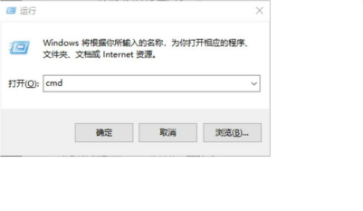
2控制台输出 conda create --name 环境名称 python==3.10 创建环境（例，condacreate –-name myTest python=3.10）当弹出如下提示时，输入 y 表示确定安装
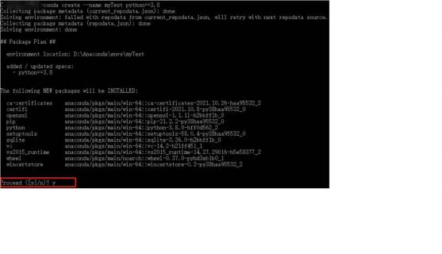
安装成功是显示如下界面
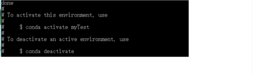
 

二 在虚拟环境中安装相关 Python 库
1在控制台输入 activate 环境名称 进入虚拟环境(例如：activate myTest)
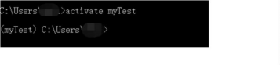
2安装 tensorflow 库 conda install tensorflow (如果没办法安装，则使用 pip install tensorflow)
安装 keras 库 conda install keras(如果没办法安装，则使用 pip install keras)
安装 matplotlib 库 conda install matplotlib

三 实验部分（pycharm，VS等等都一样）
1打开 pycharm，New Project
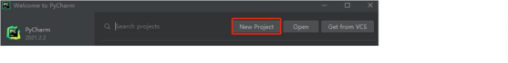

2自定义文件路径以及选择虚拟环境
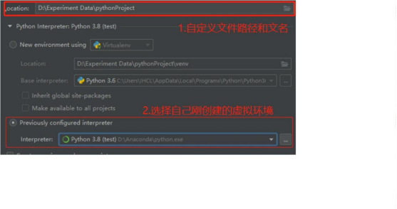
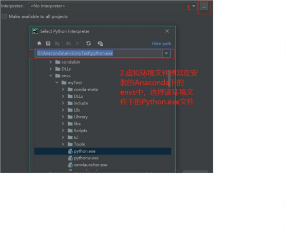
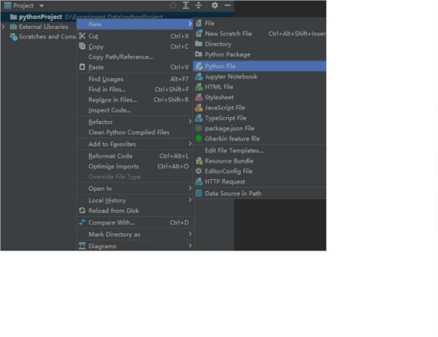

3数据是一份猫狗的图片数据集，其中训练集中包含 200 张猫的图片，200 张狗的图片。
验证集包含猫狗图片各 100 张，将数据集解压到项目根目录下的 dataset 文件（请自备训练集）

项目结构如下
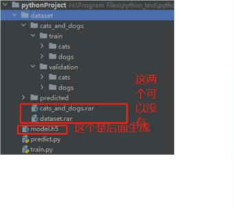

4. 新建一个 train.py 文件 训练猫狗分类模型
import os
import tensorflow as tf
from keras.optimizers import RMSprop
from keras.preprocessing.image import ImageDataGenerator
import matplotlib.pyplot as plt

#数据集地址，如果出现地址错误，则考虑使用绝对地址
base_dir = 'dataset/cats_and_dogs'
#指定每一种数据的位置
train_dir = os.path.join(base_dir, 'train')
validation_dir = os.path.join(base_dir, 'validation')

#Directory with our training cat/dog pictures
train_cats_dir = os.path.join(train_dir, 'cats')
train_dogs_dir = os.path.join(train_dir, 'dogs')

#Directory with our validation cat/dog pictures
validation_cats_dir = os.path.join(validation_dir, 'cats')
validation_dogs_dir = os.path.join(validation_dir, 'dogs')

#模型处添加了 dropout 随机失效，也就是说有时候可能不用到某些神经元，失效率为0.5

#下面是模型的整体结构，可以观察到每一层卷积之后，都会使用一个最大池化层对提取的数据进行降维，减少计算量，后续实验修改网络结构主要修改下面部分
# 设计模型
model = tf.keras.models.Sequential([
#我们的数据是 150x150 而且是三通道的，所以我们的输入应该设置为这样的格式。
    tf.keras.layers.Conv2D(32, (3, 3), activation='relu', input_shape=(150, 150, 3)),
    tf.keras.layers.MaxPooling2D(2, 2), # 最大池化层
    tf.keras.layers.Conv2D(64, (3, 3), activation='relu'),
    tf.keras.layers.MaxPooling2D(2, 2),
    tf.keras.layers.Conv2D(128, (3, 3), activation='relu'),
    tf.keras.layers.MaxPooling2D(2, 2),
    tf.keras.layers.Dropout(0.5), # dropout 层通通过忽略一般数量特征，可以减少过拟合现象
    tf.keras.layers.Flatten(), # 全链接层，将多维输入一维化
    tf.keras.layers.Dense(512, activation='relu'),
#二分类只需要一个输出
    tf.keras.layers.Dense(1, activation='sigmoid')
])
#
#进行优化方法选择和一些超参数设置因为只有两个分类。所以用 2 分类的交叉熵，使用 RMSprop，学习率为 0.0001.优化指标为 accuracy
model.compile(loss='binary_crossentropy',# 损失函数使用交叉熵
    optimizer=RMSprop(lr=1e-4), # 优化器，学习率设置为 0.0001
    metrics=['acc'])

#数据处理把每个数据都放缩到 0 到 1 范围内
#这里的代码进行了更新，原来这里只进行归一化处理，现在要进行数据增强。
train_datagen = ImageDataGenerator(
rescale=1. / 255,
rotation_range=40,
width_shift_range=0.2,
height_shift_range=0.2,
shear_range=0.2,
zoom_range=0.2,
horizontal_flip=True,
fill_mode='nearest')
test_datagen = ImageDataGenerator(rescale=1. / 255)

#生成训练集的带标签的数据
train_generator = train_datagen.flow_from_directory(train_dir, # 训练图片的位置
batch_size=20, # 每一个投入多少张图片训练
class_mode='binary', # 设置我们需要的标签类型
target_size=(150, 150)) # 将图片统一大小

#生成验证集带标签的数据
validation_generator = test_datagen.flow_from_directory(validation_dir, # 验证图片的位置
batch_size=20, # 每一个投入多少张图片训练
class_mode='binary', # 设置我们需要的标签类型
target_size=(150, 150)) # 将图片统一大小

#进行训练
history = model.fit_generator(
train_generator, # 训练集数据
steps_per_epoch=20, # 每个 epoch 训练多少次
epochs=10, # 训练轮数，建议在[10,50]如果电脑训练速度快，可以大于 50
validation_data=validation_generator, # 验证集数据
validation_steps=10,
verbose=1) # 训练进度显示方式，可取值 0，1（显示训练进度条），2（一个 epoch输出一条信息）
#保存训练的模型到当前目录
model.save('model.h5')
#得到精度和损失值
acc = history.history['acc'] # train_acc
val_acc = history.history['val_acc'] # val_acc
loss = history.history['loss'] # train_loss
val_loss = history.history['val_loss'] # val_loss
epochs = range(len(acc)) # 得到迭代次数

#绘制精度曲线
plt.plot(epochs, acc)
plt.plot(epochs, val_acc)
plt.title('Training and validation accuracy')
plt.legend(('Training accuracy', 'validation accuracy'))
plt.figure()

#绘制损失曲线
plt.plot(epochs, loss)
plt.plot(epochs, val_loss)
plt.legend(('Training loss', 'validation loss'))
plt.title('Training and validation loss')
plt.show()

运行 train.py 之后可以得到以下图片随着训练 epoch 的迭代，训练集和验证集的准确率以及loss
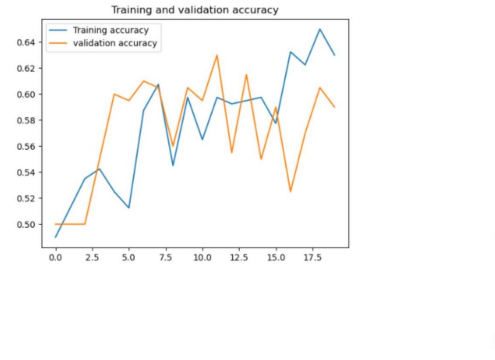
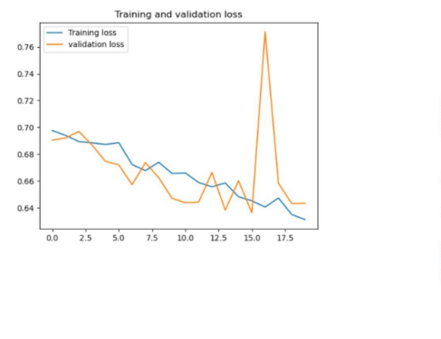

5. 新建一个 predict.py 文件 调用训练好的模型，进行测试
#预测
from tensorflow.keras.models import load_model
import numpy as np
from tensorflow.keras.preprocessing import image
#测试图片地址
path = 'dataset/predicted/dog1.jpeg'
#加载模型
model = load_model('model.h5')
#将图片转换成 150*150 的格式，与模型训练的输入保持一致

img = image.load_img(path, target_size=(150, 150))
x = image.img_to_array(img) / 255.0
#在第 0 维添加维度变为 1x150x150x3，和我们模型的输入数据一样
x = np.expand_dims(x, axis=0)
#np.vstack:按垂直方向（行顺序）堆叠数组构成一个新的数组，我们一次只有一个数据所以不这样也可以
images = np.vstack([x])

batch_size #批量大小，程序会分批次地预测测试数据，这样比每次预测一个样本会快
classes = model.predict(images, batch_size=1)
classes[0]#表示分类概率，大于 0.5 表示分类为 dog，小于 0.5 表示分类为 cat

print(classes[0])
if classes[0] > 0.5:
    print("It is a dog")
else:
    print("It is a cat")

 
运行 predict.py 文件得到以下结果，与测试的预期值一样
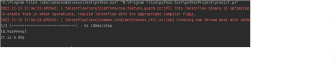