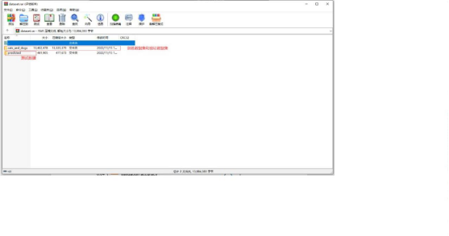

# 机器学习猫狗分类模型训练（模型入门训练）

## 一、创建虚拟环境

1. Windows+R 输入 cmd 打开控制台

2. 控制台输出 `conda create --name 环境名称 python==3.10` 创建环境  （例：`conda create --name myTest python=3.10`）当弹出如下提示时，输入 `y` 表示确定安装

3. 安装成功时显示如下界面


 

## 二、在虚拟环境中安装相关 Python 库

1. 在控制台输入 `activate 环境名称` 进入虚拟环境  （例如：`activate myTest`）


2. 安装必要的库：
```bash
   conda install tensorflow  # 如果无法安装，则使用 pip install tensorflow
   conda install keras       # 如果无法安装，则使用 pip install keras
   conda install matplotlib


## 三、实验部分（PyCharm/VSCode等IDE均可）
1. 打开 PyCharm，新建项目


2. 自定义文件路径以及选择虚拟环境


3. 数据是一份猫狗的图片数据集，其中训练集中包含 200 张猫的图片，200 张狗的图片。验证集包含猫狗图片各 100 张，将数据集解压到项目根目录下的 dataset 文件（请自备训练集）


项目结构如下


4. 新建一个 train.py 文件 训练猫狗分类模型
```python

import os
import tensorflow as tf
from keras.optimizers import RMSprop
from keras.preprocessing.image import ImageDataGenerator
import matplotlib.pyplot as plt

# 数据集路径（如报错可改用绝对路径）
base_dir = 'dataset/cats_and_dogs'
train_dir = os.path.join(base_dir, 'train')
validation_dir = os.path.join(base_dir, 'validation')

# 训练集路径
train_cats_dir = os.path.join(train_dir, 'cats')
train_dogs_dir = os.path.join(train_dir, 'dogs')

# 验证集路径
validation_cats_dir = os.path.join(validation_dir, 'cats')
validation_dogs_dir = os.path.join(validation_dir, 'dogs')

# 模型架构（含Dropout层防止过拟合）
model = tf.keras.models.Sequential([
    tf.keras.layers.Conv2D(32, (3,3), activation='relu', input_shape=(150,150,3)),
    tf.keras.layers.MaxPooling2D(2,2),
    tf.keras.layers.Conv2D(64, (3,3), activation='relu'),
    tf.keras.layers.MaxPooling2D(2,2),
    tf.keras.layers.Conv2D(128, (3,3), activation='relu'),
    tf.keras.layers.MaxPooling2D(2,2),
    tf.keras.layers.Dropout(0.5),
    tf.keras.layers.Flatten(),
    tf.keras.layers.Dense(512, activation='relu'),
    tf.keras.layers.Dense(1, activation='sigmoid')
])

# 模型编译配置
model.compile(loss='binary_crossentropy',
              optimizer=RMSprop(lr=1e-4),
              metrics=['acc'])

# 数据增强配置
train_datagen = ImageDataGenerator(
    rescale=1./255,
    rotation_range=40,
    width_shift_range=0.2,
    height_shift_range=0.2,
    shear_range=0.2,
    zoom_range=0.2,
    horizontal_flip=True,
    fill_mode='nearest')

test_datagen = ImageDataGenerator(rescale=1./255)

# 生成训练数据
train_generator = train_datagen.flow_from_directory(
    train_dir,
    batch_size=20,
    class_mode='binary',
    target_size=(150,150))

# 生成验证数据
validation_generator = test_datagen.flow_from_directory(
    validation_dir,
    batch_size=20,
    class_mode='binary',
    target_size=(150,150))

# 训练模型
history = model.fit_generator(
    train_generator,
    steps_per_epoch=20,
    epochs=10,
    validation_data=validation_generator,
    validation_steps=10,
    verbose=1)

# 保存模型
model.save('model.h5')

# 绘制训练曲线
acc = history.history['acc']
val_acc = history.history['val_acc']
loss = history.history['loss']
val_loss = history.history['val_loss']
epochs = range(len(acc))

plt.plot(epochs, acc)
plt.plot(epochs, val_acc)
plt.title('Training and validation accuracy')
plt.legend(('Training accuracy', 'validation accuracy'))
plt.figure()

plt.plot(epochs, loss)
plt.plot(epochs, val_loss)
plt.legend(('Training loss', 'validation loss'))
plt.title('Training and validation loss')
plt.show()

运行 train.py 之后可以得到以下图片随着训练 epoch 的迭代，训练集和验证集的准确率以及loss


## 四、新建一个 predict.py 文件 调用训练好的模型，进行测试
```python

from tensorflow.keras.models import load_model
import numpy as np
from tensorflow.keras.preprocessing import image

# 加载测试图片
path = 'dataset/predicted/dog1.jpeg'
model = load_model('model.h5')

# 预处理图片
img = image.load_img(path, target_size=(150,150))
x = image.img_to_array(img)/255.0
x = np.expand_dims(x, axis=0)
images = np.vstack([x])

# 预测
classes = model.predict(images, batch_size=1)
print(classes[0])

if classes[0] > 0.5:
    print("It is a dog")
else:
    print("It is a cat")


运行 predict.py 文件得到以下结果，与测试的预期值一样

